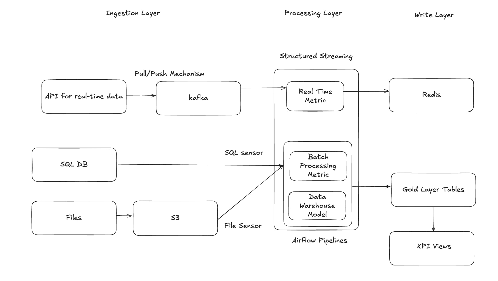

Notes:

- [ER Diagram design for E-commerce](https://bgiri-gcloud.medium.com/designing-the-database-schema-for-a-new-e-commerce-platform-and-considering-factors-like-ec28d4fb81db)
- [Data Model for Uber](https://medium.com/towards-data-engineering/data-modelling-design-the-data-model-for-a-taxi-service-like-uber-eaedfa0e25f4)

- Things I have doubt on:
  - What are the difference between OLTP and OLAP system design.
  - Only medallion architecture is not the entire system.



# System Design for E-commerce platform related to data side

- In system design they don't need a solution, but they want to know about approach how we are able for critical thinking.

## Step-1: Questions we need to ask

1. Here if they say that we have to build platform for ecommerce then we don't need to assume that it will be like amazon or walmart. But rather we have to ask them that do you want to build a system like amazon or walmart ?
2. Are you asking to build transactional or analytical system ? Both OLTP and OLAP systems have different solution.
3. Who will be the end consumer of this data ? From this we will be able to know about insights of data.
4. What is the scale of data and what is the anticipated scale in upcoming 6 months or a year ? This is purely for scalability.
5. Is there any existing service which I should be aware of ? To get the context of existing system.
6. What is the most important feature which I should start with ? To get the good starting point to start building system.
7. Here ecommerce is a big topic, there are multiple entities in the data platform, so what to include and where to start:
   - user
   - product
   - category
   - order
   - orderItem
   - CartItem
   - Reviews
   - Payment
   - inventory

## Step-2: Data storage estimation

1. Scalability
   - Here the size will be calculated in this format:
     - 2^10 bits -> 1 KB
     - 2^20 bits -> 1 MB
     - 2^30 bits -> 1 GB
     - 2^40 bits -> 1 TB
     - 2^50 bits -> 1 PB
   - Here the point is, we need to ask that how much amount of data we will be handling per hour, per day and so on...
   - Here sometimes, in a regular day the data ingestion is low. But like on big billion day sale, the data ingestion will be much high.
   - So we need to calculate those things.

2. Latency -> (Microservice/Streaming)
   - Here we are sending the data over the network.
   - Adding compression to the data
   - Multi region copy.
   - Here in the case of streaming we generally use kafka, which uses JSON with configurable snappy. With this we can see 5X compression.

3. Availability
   - Pipeline criticality
   - Pipeline Up-time / Down-time
   - Tier-1 / Tier-2 / Tier-3
   - Here which tier pipeline are we desiging.
   - Basically if we are building tier 1 pipeline then the up-time should be 99%.

4. Let's calculate the storage requirements

- Total data on daily bases. If interviewer provides the rough number about data we will get on daily bases then it is fine otherwise we need to calculate it.
- We will calculate it based on the number of total users, or monthly active users ?
- So let's say interviewer says that we will be receiving 200 GB per day then yearly we will receive 400(round figure) * 200 = 80000 GB that is roughly 80 TB.
- Now the question comes that we want to keep 80 TB per year data ? or purge it ? or archive it ? or keep it in cold storage ?
- Like in analytical systems the data of last 3 years are kept in the active storage.

## Step 3: Propose high level design

- We need to use excalidraw here.
- Here we discuss the high level solution

1. Input data type
   - What will be the data format type of input data (CSV / Parquet).
   - Frequency (Data will be arrived hourly / daily / weekly).
   - Schema evaluation (Different sources sends data, like source systems, APIs. In the case of APIs schema evolves too frequently).
   - PII data (This data stores the information that can be used to identify any individuals like name, email, phone number, Aadhaar).

2. Business use case
   - Metric to Track: Which entity will be used mainly ? Like they might want to use the inventory metric, now we need to ask that we need to design batch or streaming pipeline for this metric.
   - SLA: Here SLA means, by this time pipeline must produce the results. There must not be any delay after the SLA, Otherwise it will create SLA breach.

3. Output
   - Target system: What will be the target system to store the output. In case of streaming we need to use in memory cache like Redis. In case of batch we can use data lake like s3.
   - Data retention: The policies that companies applies to keep the data active. Details about when to archive, when to purge and so on.
   - Refresh frequency: How many times the data will get updated in tables. Daily / hourly / real-time. Depends on the output storage type. In redis the data will be refreshed in real time, in S3 the data will be refreshed hourly or on daily bases.

## Step 4: Designing entire system

- This system will cover the following topics:
  - Real Time Analysis
  - Historical Analysis
  - Scalability (Data + Processing)
  - Flexible data model (Captures frequent evaluations in schemas)

### Here are the different parts of entire system

#### Data Source

- Real-Time datasource
    - APIs: In general cases the data comes from APIs, like clicks and connect events. In the case of ecommerce applications rider tracking and delivery tracking events comes from APIs.
- Batch datasource
    - Database (SQL/NoSQL): The batch data mainly comes from OLTP systems. This is the huge amount of data and we need to ingest it in our systems using jdbc drivers.
    - File Systems: Some source systems directly dumps files into our raw data lakes.

#### Data Ingestion

- Real-Time data ingestion
  - Kafka - producer, consumer
  - Here we have a system that ingests data from APIs to the kafka. Here we have two choices.
  - Kafka Pull / Push based mechanisms
  - Pull based mechanism:
    - In this mechanism the kafka connector keep polling the API endpoint to check that data is arrived or not.
    - If the data is available it ingests data from API to the kafka topics.
    - Here we can control the frequency and timing of the data collection.
  - Push based mechanism:
    - In this mechanism API actively sends the data to kafka producers whenever the data is available.
    - Here we need to add the webhooks which will ingest the data from APIs to kafka producers.
  - When the latency matters, and we want to build the accurate near-real-time systems then we use Push mechanism. 
- Batch data ingestion
  - S3
  - Here we keep the data into multiple folders.
  - Daily running job will access the layered folders (medallion architecture).
  - Here we also keep the incremental load folders.
  - Like some entities might need to get the data on hourly or daily bases. For these entities we create daily, hourly folders.
  - Here in the medallion architecture we design bronze-silver-gold layers.
  - For each layer we keep the S3 bucket to store the actual parquet files.
  - Each storage layer will have particular bucket for the specific entity.
  - Here the questions may arrive:
    - How the data will come, in which folder will it come
    - What partitioning will be applied
    - Here to pull the data from database or to get the files from file system we need some pull mechanism.
    - How this pull mechanism will work ?
    - 

#### Processing Layer

- Designing pipelines on particular metric
  - Here different metrics will get processed in different manner.
  - Some metric like product analysis will be processed in batch jobs.
  - Whereas some metrics like delivery-partner location will be processed in streaming jobs.
  - Now here let's say we are running sync on 6 hours.
  - So the metric which will get calculated will take total of data processed from batch job + some business use cases considering incremental data.
  - These incremental data will get loaded from S3 buckets separately created for daily / hourly bases.
  - Here checkpointing table will be used. What is checkpointing table ?
- Data Warehouse Modeling
  - Here the purpose of data warehouse is to store the data efficiently.
  - Here the data model will be designed only once.
  - In the data model we define multiple entities. These entities can be dimension or fact.
  - Based on these entities and their relationships we design the data warehouse.
  - This will be explained in detail in the section later.
  - Here if we are using snowflake as a data warehouse then they might ask
    - What is transient table, permanent table, materialized view


#### Data sinks

- Real-Time data sink
  - kafka
  - Redis
  - For real time we must use kafka or redis. The only purpose is to retrieve the data faster.
- Batch data sink
  - DB (SQL/NoSQL): In some cases we use SQL or Nosql to ingest the result production ready data.
  - S3
  - Mostly we use S3 to store the gold layere data.
  - Sometimes we use data warehouse to provide the final data.
  - Here entire system runs either near-real-time or hourly/daily sync.

#### Scheduling

- Airflow
  - We use this to schedule our batch jobs.

#### Automated deployment

- We use docker images, github actions and terraform for automatic deployment.


#### Exception handling

- What is rollback, fault-tolerant. There are trade-offs.
- Here we also take care of rollback of faulty data in the system. Also we take care of fault-tolerance. How pyspark is fault-tolerant ?
- Here we write unit test cases on the components of the system that we have designed.
- We perform proper exception handling on the code that is written.
- Sometimes we don't write the proper exception handling, In that case sometimes our code might fail.
- The failure can be due to some environment issues or the code that we have written is unable to handle the data.
- Or our code might fail to handle complex scenarios, In these cases we need to handle exceptions properly.

### Step 5: Detailed explanation of each component used in the system

#### API

- Microservices
- Event Driven Architecture
- Pull / Push Mechanism
  - Pull Mechanism: Here the kafka-controller keep polling the endpoint of the API that data is arrived or not.
  - Push Mechanism: Here we need to add the webhook which will ingest the data to kafka producers whenever it is available.
- Authentication
  - Generally we use JWT token
- Design Patterns
  - We have designed our backend API using SOLID principles.
  - Airflow-Deployment strategy:
    - To deploy the airflow dags.
    - This strategy hits the airflow rest API to trigger the dag.
  - Spark-K8s-Deployment strategy:
    - To deploy the streaming deployment yaml on kubernetes.
    - This takes the required variables from source system and deploys the yaml in dataplane.
- Async Programming
  - Async/Await is used to design the backend API.

#### Database

- SQL vs Data Warehouse
  - Here SQL systems focus more on day-to-day transaction and how rapidly they can be processed.
  - Here the data is stored in more normalized form. Implemented upto 3rd normal forms.
  - These are designed for rapid transaction, high concurrency and data integrity.
  - Here multiple validation rules are applied, also row level constraints are applied.
  - So OLTP systems are build for low latency, rapid processing of transactions and lowest redundancy in data with normalization.
  - Now talking about Data warehouse
  - DW generally used for analytical purpose.
  - Here business team performs analysis on huge volume of historical data.
  - Here the data latency is not as rapid as the OLTP systems.
  - Here the data is stored in denormalized form for analytical workloads.
- DB Internals
- Volume Challenges
  - If our data keeps growing day by day then is it a good solution to keep the data in SQL DB or should we use data warehouse.
  - What are the challenges do we face if we keep the data in SQL DB vs we keep it in data warehouse.
- Optimization
  - Optimization from both sides, In DB and in running queries.
- Indexing / Sharding / Caching / Materialized Views
  - Indexing:
    - Indexing is the technique for faster data retrieval.
    - Like in a book the index contains the page number for particular chapter. 
    - Same as that in database index contains stored copy or indexed column value and the actual table row. This allows the faster retrieval.
    - Indexes are generally applied on:
      - primary key.
      - foreign key.
      - keys used in join, order by, group by.
      - Indexing speed up the read operation, but it slows down the write operation like (INSERT, UPDATE, DELETE).
  - Sharding: (sharding is used in NoSQL database)
    - Sharding is a database optimization technique.
    - When the volume of data in given database grows upto certain level then sharding is applied.
    - Here we divide the actual database into number of shards.
    - Each shard contains the portion of total data. Not the entire data.
    - There are sharding techniques:
      - Range based sharding: For a given table the data will be divided between range of ids.
      - Hash based sharding: Hash function is applied to create shards.
      - Directory based sharding: Use a look-up service to check that in which shard, particular data exist.
- ACID properties
  - Atomicity: 
    - Transactions must be atomic. 
    - This means If we are performing a query that performs two operations
      1. Brake the FD and credit the money into current account.
      2. Invest all the money from current account to mutual funds.
    - Here either both the operations will be performed or none of them will be executed.
    - Means if the first operation executed successfully and second one failed with the system crash error.
    - Then first operation must be roll back.
  - Consistency:
    - Data must be consistent throughout the system. It should not breach any rule or validation.
    - If the current balance in account is $150 and someone tries to withdraw $200 then it must fail.
  - Isolation:
    - Data activity must be isolated to multiple different users.
    - When two users are booking tickets in flight.
    - Here user 1 is trying to book ticker E15 then that option should be blocked for user 2 for a given timeframe.
    - And when user 1 completes the booking in a given timeframe then the updated result should be shown to all the active users.
  - Durability
    - Status of all the transactions must be updated throughout the system.
    - Which means if we are trying to make a payment and money got debited from account.
    - And success status arrived at screen and suddenly system fail.
    - In this case there is not issue in payment. So payment status must remain successful in the system.
    - It is the issue in system that needs to be fixed.
- Constraints / Normalization / De-normalization
  - Constraints:
    - Constraints are mainly used to prevent the system from getting the bad data.
    - It is a type of data quality check. 
    - If we add any constraint in designing the logic then it must be applied on the data all over the system.
    - These are the constraints:
      - Primary Key: All tables must have primary key
      - Foreign Key: If any primary key from another table is present in current table then it is foreign key.
      - Not Null: There should not be null record in the table. If there are nulls then they should be converted into proper format.
      - Unique key: Same value for different record is not acceptable. Same email for two persons.
      - Check: Current table must contain the desired values. If we add a filter in table then that should not be breached.
      - DEFAULT: Add default value to particular column.

  - De-Normalization
    - Generally we use de-normalization in OLAP systems.
    - OLAP systems are designed for performing faster analysis.
    - For this we add duplicated data into table, so we don't want to perform multiple joins and aggregations.
    - So queries applied for analytical operations are much faster.
  - Normalization
    - Normalization is database designing technique.
    - This technique reduce data redundancy and improves data integrity by organizing fields and tables in database.
    - It divides larger tables into smaller tables and defines the relationship between them.
    - Here the goal is to remove data duplication, improve data consistency and optimize the operations.
    - Normalization is mostly used in OLTP system because in these systems the goal is to perform CRUD operations at speed.
    - So if we add the normal forms it will improve the query performance.
    - Generally in the production grade application we applied upto 3rd normal form.
    - Here the queries applied for transactional data like insert, update, delete will be much faster.

Example

Student Table:

| StudentID | StudentName  | Course1  | Course2  | AdvisorID | AdvisorName | AdvisorDept |
|-----------|--------------|----------|----------|-----------|-------------|-------------|
| 101       | John Smith   | Math     | Physics  | A1        | Dr. Jones   | Science     |
| 102       | Emma Wilson  | History  | English  | A2        | Dr. Brown   | Humanities  |

- Here we have two columns for courses. 
- If we make an update in one field then entire row will get updated.
- Two different values in single column are not allowed. Also, two different columns with similar values are not allowed.

1st normal form

| StudentID | StudentName  | CourseID | AdvisorID | AdvisorName | AdvisorDept |
|-----------|--------------|----------|-----------|-------------|-------------|
| 101       | John Smith   | MATH101  | A1        | Dr. Jones   | Science     |
| 101       | John Smith   | PHY201   | A1        | Dr. Jones   | Science     |
| 102       | Emma Wilson  | HIST101  | A2        | Dr. Brown   | Humanities  |
| 102       | Emma Wilson  | ENG201   | A2        | Dr. Brown   | Humanities  |

2nd normal form

- No partial dependency: Each non-key attributes must be dependent on unique primary key

Student Table:

| StudentID | StudentName  | AdvisorID |
|-----------|--------------|-----------|
| 101       | John Smith   | A1        |
| 102       | Emma Wilson  | A2        |

Enrollment Table:

| StudentID | CourseID |
|-----------|----------|
| 101       | MATH101  |
| 101       | PHY201   |
| 102       | HIST101  |
| 102       | ENG201   |

Advisor Table:

| AdvisorID | AdvisorName | AdvisorDept |
|-----------|-------------|-------------|
| A1        | Dr. Jones   | Science     |
| A2        | Dr. Brown   | Humanities  |


3rd Normal form

- No transitive dependency: Each non-key attributes must not be dependent on another non-key attribute. 

Student Table:

| StudentID | StudentName  | AdvisorID |
|-----------|--------------|-----------|
| 101       | John Smith   | A1        |
| 102       | Emma Wilson  | A2        |

Enrollment Table:

| StudentID | CourseID |
|-----------|----------|
| 101       | MATH101  |
| 101       | PHY201   |
| 102       | HIST101  |
| 102       | ENG201   |

Advisor Table:

| AdvisorID | AdvisorName | DeptID |
|-----------|-------------|--------|
| A1        | Dr. Jones   | D1     |
| A2        | Dr. Brown   | D2     |

Department Table:

| DeptID | DeptName   |
|--------|------------|
| D1     | Science    |
| D2     | Humanities |


#### File Types

- Parquet
  - Why to use parquet, Which optimizations will be used ?
- Delta Tables
  - When we want to use ACID properties with parquet file then we use the Delta table format.
  - Basically Parquet files provide insert and overwrite mode only.
  - We can't perform ACID properties like merge, delete.
  - As pyspark with parquet doesn't provide native support to perform ACID properties.
  - We use delta tables to perform ACID transactions directly in pyspark.
- CSV
- Structured / Semi Structured
  - If we are using parquet or CSV files we will get the structured data.
  - But there might be some cases when we are getting data from APIs then it will send semi-structured data.
  - In the case of semi structured data the file will keep refreshing at a given cadence.
  - So the schema of a data might also evolve with time, so how we handle this case in our system ?

#### S3

- Cost Analysis
  - Here we have performed data storage estimation, That is 80 TB per year.
  - So how much data we want to keep active in the data lake ?
    - Here we can ask business, that how much data do they want to see actively.
    - Like in amazon, in the order history it shows only the orders of last 1 year.
    - If we want to fetch the records before 1 year then it will take some more time to process.
- Cold Storage
  - So here the data beyond the activity time will be kept in the cold storage.
  - This will not be directly fetched. But this will be accessed when the user hits API.
  - Not entire data will be kept in cold storage but the particular segment of data will be kept in it.
  - What is cold storage ? Which tool should we use as a cold storage ?
- Purging data logic
  - Here we keep purging old unused data.
  - Like machine logs / metadata generated by the system which can be used when the data is active.
  - Once the data is moved to cold storage then we can purge these logs.
- Data Lake / Delta lake
  - This is explained already.
- Rest encryption
  - How we perform encryption on the data ?
- Partitioning
  - How and why to do partitioning.
  - Generally we don't keep the entire data into single parquet file.
  - We perform partitioning on date, month and year.
  - So let's take an example of netflix data. Here each country will have millions of users.
  - And for a particular date they are watching particular content.
  - So we can't store entire data into single file.
  - We perform partitioning based on our need.
  - Like we create country partition first then we create date partition second.
  - So at the time of performing queries and running jobs. If the data is stored in partitions then it is efficient to retrieve and perform operations on that data.

#### Kafka

- Back Pressure:
  - We build a streaming pipelines where we expect the source data upto certain limit of volume.
  - Sometimes we receive the data from kafka topics which is much more than the amount we can process.
  - At this point we enable the back-pressure.
  - `maxOffsetsPerTrigger` is used to controll the size of data we are receiving.
- Offset management
  - In kafka when we produce the messages in topics. The offset works as an index to that message in a topic.
  - from the offset we can identify that the message is consumed or not.
  - Like while consuming the messages from kafka, we create kafka stream with option `startingOffset` = `earliest` or `latest`.
  - Earliest means in the case of structured streaming job failure, it will start consuming from the first message.
  - Latest means in the case of failure it will start consuming from the latest message.
  - In structured streaming job we store the offsets in checkpoint location.
  - Spark automatically manages the message consumption from checkpoint path. 
  - If the application fails it will start consuming from the last offset stored in the offset directory.
- Broker / Producer / Consumer
  - Kafka: Kafka is a real-time streaming service. Which generates, publishes messages and processes records in real time. 
  - Broker: 
    - broker is a server that stores data and serves it to client. 
    - It manages data into multiple partitions of kafka topic.
  - Producer:
    - It publishes the message into kafka topic.
    - Generally we have producer scripts which works on Pull / Push based mechanisms.
    - So we apply these mechanisms in producer script.
  - Consumer: In this case pyspark structured streaming will be our consumer script, This consumes the messages near real-time.
  - Zookeeper: This is the management system which keeps looking on which kafka broker is alive and which partition or topic they are responsible for.
- Kafka Connect
- Topic and its management with partitions
  - Topics works as a data source for real-time streaming / Pyspark structured streaming.
  - Topics handles event-driven data at high scale.
  - Here to optimize the performance we produce the data into kafka topics in parallel. 
  - For parallel message production we use partitions in kafka topics.
  - The number of partitions defined in kafka topics we can use the same number of partitions in consumer side for better processing.
- Auto commit, Linger time
  - How can we remove auto commit and what will happen if we remove auto commit ?
  - What is linger time ?
  - Auto commit is an option generally used in kafka consumers when it is enabled it will automatically commit the latest offset
  - If not enabled then we have to manually manage it.
  - But generally we use pyspark structured streaming to process real-time data. In this case we can manage it using checkpoint path.
  - 
- exactly once record process
  - This is about handling the fault tolerance
  - Here we can achieve this by adding few things
  - adding checkpoint path: Here if the streaming application fails and restarts it will start from the latest offset in checkpoint path.
  - making failOnDataLoss to false: If there is a data loss from the kafka producer side then system won't fail after enabling this option.
  - making kafka.enable.idempotence to True: At the time of writing data to kafka topic it will write the message exactly once.
- Replication
  - Kafka uses a replication factor to determine how many copies of each partition should exist.
  - Let's say we have three brokers with replication factor = 1. If one broker fails due to an environmental error, any partitions hosted only on that broker become unavailable.
  - With replication factor = 1, a broker failure would cause errors for any consumer or producer working with the unavailable partitions.
  - By increasing the replication factor (e.g., to 2 or 3), we keep multiple copies of each partition across different brokers.
  - Then if one broker fails, consumers and producers can continue working with the replicas on the remaining brokers. This is how replication prevents failures from disrupting the system.

#### Spark Streaming

- checkpointing
  - For fault-tolerance we use checkpointing.
  - Here we add checkpoint path at the time of processing the real time data.
  - checkpoint path contains:
    - offsets. The offsets generated from the kafka topics.
    - Current state of stateful operations like aggregations, windows.
    - metadata of streaming query.
  - Here if due to any reason the job fails then at the time of restart it won't calculate the data from the beginning.
  - But it will start from the latest offset that is processed.
- commits
  - When we add the checkpoint path in spark streaming application at the time of writing data to sink.
  - At the time of processing the streaming query it commits few things:
    - The current offset of the data.
    - The state of the computation.
    - What data is processed.
- late data arrival
  - In structured streaming applications before processing the operation on the data we use withWaterMark.
  - Here we add watermark delay threshold.
  - Let's say if the watermark delay threshold = 5 minutes.
  - Then it will consider the data for maximum event time - 5 minutes.
  - Data which is late then that time will not be considered for processing.
  - Here when the data is generated from the kafka topic it must contain event generation time.
  - So at the time of processing the records we consider the records upto time = maximum event time - 5 minutes.
  - So let's say we are processing right now, and we can see that maximum event time till now is 10:30:15
  - And watermark delay is 5 minutes then we consider the late records upto 10:25:15 not beyond that.
  
- sliding window agg
  - We use this operation to see the behaviour of particular metrics changing over the time.
  - Here we define window duration and slide duration.
  - Here the spark creates new window of window duration after sliding for given slide duration.
  - Means, let's say we start processing at 10:00. Here window duration = 10 minutes and slide duration = 5 minutes.
  - Then first window will be created for 10:00-10:10.
  - Now this window will slide for 5 minutes, Means at 10:05 the second window will be created.
  - Second window will be created for 10:05-10:15.
  - Here the purpose of this operation is to calculate aggregate value of particular metrics over the time.
  - Means some data points can appear in window 10:00-10:10.
  - The same record will appear in window 10:05-10:15.
  - Both of these windows are overlapping.
  - So data points arrives in overlapping windows will be considered multiple times.
  - This is the purpose. As we calculate the aggregated values too frequently.

  for example:
  ```
  Event data:
  - (10:02, sensor_1, 72°F)
  - (10:07, sensor_1, 74°F)
  - (10:12, sensor_1, 75°F)
  - (10:17, sensor_1, 76°F)
  ```
  - Here the sensor_1 will appear in two window 10:00-10:10 and 10:05-10:15.
  - So the aggregated value for temperature in window 10:00-10:10 = 73.
  - And aggregated value for temperature in window 10:05-10:15 = 74.5.

- stateful / stateless calculation
  - Stateful operations calculates data across multiple micro-batches. Like sliding window aggregation.
  - Stateless operations calculates data within distinct micro-batches. Like filter operations.
- micro-batch / continuous
  - Micro batch processes the records for a specified time interval.
  - Let's say if we define the micro batch of 30 seconds then it will process the records that comes within that batch.
  - Next set of records will be processed in next micro-batch.
  - Continuous means there is no micro-batch pattern, Pyspark itself determines the duration and process it continuously.
- event time
  - Here the concept of exactly one semantics comes.
  - Which time should we consider, The time when data got generated by the source system or the time when data arrived and processed ?
  - Here event time is preferred.
  - It is used for accurate data analysis.
  - In the processing time there might be some delays due to delay in operation.
  - It allows handling of late data.
- performance optimization
  - dynamic allocation
  - process data in micro batches instead of processing records one by one in redis.
- fault tolerance
  - Let's say the retention period in the kafka source is 6 hours.
  - Then data will be removed after 6 hours, then what will we do in the case of failure.
  - Will we increase the retention period to 24 hours in kafka ? But in this case we need to use the bigger kafka cluster.
  - We need to discuss this.
  - I have two approaches either increase the retention time period or add the checkpoint path location.
- spark structured streaming vs flink
  - Why to use structured streaming and why not flink ?

#### Processing Layer

- Medallion Architecture
  - Bronze: 
    - As it is copy of the data from source side. We don't perform too many data validations.
    - Adding metadata columns like data source location for each record.
    - The timestamp when data got loaded.
  - Silver:
    - Here we perform all the data validations
    - Remove null values.
    - Assign proper data type to each column.
    - Data Quality Checks:
      - Consistency
      - Accuracy
      - Validity
      - Completeness
      - Timeliness
      - Uniqueness
  - Gold
    - Here we keep the production ready tables for each entity.
    - Dimension Tables and Fact Table.
    - In the gold layer we keep the business specific logics in our pipeline.
    - These logic can vary from business to business.
    - Here business can perform the analysis using group by, join, filters between the fact and dimension tables.
    - We can enable the option of KPI views instead of performing queries everytime.
- Here in the Gold layer sometime they focus on data security
  - When we are processing PII data then how do we provide access to PII data to user ?
  - How do you provide column level and row level access to user ?
  - We have built a data platform where the multiple users will access multiple data.
  - How you provide the access to the particular data in the gold layer ?
    - Here we can keep RBAC
  - How to write the UDF logic to access PII data ?
  - Here the data security and data governance comes in the picture.


#### Dimensional Modeling

- Here we can build two types of ER diagram
  - ER diagram for sources system. Which depicts the entities and relationships between them.
  - ER diagram for our data warehouse model with Fact and Dimension Tables.
- These are the examples to prepare:
  - e-commerce
  - Ola / Uber
  - Finance domain (banking system, net banking, credit card, debit card)
  - Health domain

#### Scheduling and Orchestration

- Airflow
  - Internal workings
  - Type of executors:
    - In apache airflow role of executors determines how and where the task will get executed.
    - They acts like an execution engine.
    - When airflow assigns task as ready, it supplies the task to the executor.
    - Now executor is responsible to execute the task in its specific environment.
    - Here we are using kubernetes executor. We run our tasks on kubernetes.
    - Here are the types of executors:
      - LocalExecutor
      - SequentialExecutor
      - KubernetesExecutor
      - CeleryExecutor
  - DAG:
    - Airflow executes the set of tasks in Directed Acyclic Graph pattern.
    - Here the graph is created of nodes and edges.
    - Each node represents task and edge represents the path that after this task the next one will be executed.
    - Here the cycles are not allowed.
  - Task
    - Task is a fundamental building block of airflow.
    - We can use task to perform or execute specific operation.
    - Task can be executed, scheduled, retried.
    - Here we can set the upstream and downstream dependencies for the task.
    - Here the dependencies shows that without executing this task the next task can't be executed.
    - Airflow dag is created of a bunch of tasks.
    - Here we can define a DAG with the route that either the task will get executed in sequential pattern or in parallel pattern.
  - Operators
    - Task can be defined using operators.
    - Here we have default operators and custom operators.
    - PythonOperator and BashOperator are the default.
    - In custom operators we can build our own operators.
    - Like in data platform we build spark on kubernetes operator.
    - Here in the custom operators we can give the custom set of arguments that is required at the time of launching the application.
  - Sensors
    - These are special operators in airflow.
    - sensors waits for specific condition to become true before proceeding for the next task.
    - In data platform we have multiple entities. Each entity will have tables in bronze, silver and gold layer.
    - Fact table is created by referencing the dimension tables of multiple entities.
    - So if data for a specific date for given entity is not arrived yet then Fact table process will fail.
    - So in this scenario we can use two sensors:
      - S3KeySensor: File Sensor which will wait for the files to be arrived in stage location.
      - SQLSensor: This will wait until records got loaded to all the dimension tables.
    - Here we have two modes:
      - poke: Sensor will occupy the worker slot to check the dependency. It will go to sleep if dependency is not fulfill.
      - reschedule: It will get rescheduled after a specific interval.
  - Custom Operators
    - As defined above we can design our own custom operators.
    - Like we are using custom spark kubernetes operator.
  - XCom
    - xcom provides a vay to exchange some variables between tasks of a given DAG.
    - Here let's say we have two tasks. one task performs data load to bronze layer.
    - Another task performs data load to silver layer.
    - Now after successful run of bronze layer task we perform row count and push it to the xcom.
    - Now via xcom the silver layer task will extract the values and use it for the further calculation.
  - Backfill
    - Let's consider the scenario where airflow dag is running from last one month.
    - Between the month new task is added in the airflow dag.
    - Now we want to run that task on the previous 15 days. Then in this case we need to use backfill.
    - Either we can run the backfill task directly by the command `airflow backfill my_dag -s [start_date] -e [end_date] -t task_id`.
    - We can use the task_id that we want to trigger for a given time interval.
    - In the data platform we have created a backfill dag where we can provide the custom inputs.
  - Pools
  - Automation